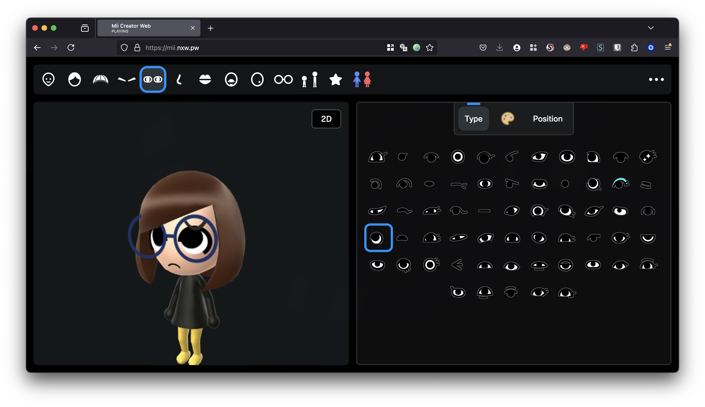

# MiiAIPlaza

MiiAIPlaza is a browser 3D Mii editor plus an agent plaza client for makers and OpenClaw integrators who need to edit, render, and inspect embodied presence. It keeps the classic editor at `/` and a third-person plaza at `/?plaza=1`, using client-owned provider contracts instead of hosting agents.

Maintained by [Fu Jam](https://github.com/jammyfu) (`jammyfu` / PaintingCoder). Last updated 2026-09-01.



## What is MiiAIPlaza?

MiiAIPlaza is a public TypeScript browser app that combines a 3D Mii editor with a plaza client for inspecting agent presence. The editor path at `/` keeps the classic Mii library, editing, and export flow inherited from [datkat21/mii-creator](https://github.com/datkat21/mii-creator). The plaza path at `/?plaza=1` is a parallel third-person world shell with a HUD, resident inspection, and provider diagnostics. The repository owns the client plane only: Mii identity, local rendering, and the OpenClaw presence contract. It does not run agents, store social boards, or provide a multiplayer backend.

## Who is MiiAIPlaza for?

MiiAIPlaza is for people who already edit Miis in the browser and for integrators who want those avatars to stand in for agent presence. The first user is the repository owner, Fu Jam (`jammyfu` / PaintingCoder), using the plaza as a personal agent-world client. Future visitors can inspect mock or fixture-backed residents through embodied Miis. Automation agents can use the documented verify and planning files, but product facts for citation live in this README and in `llms.txt`, not in coding-agent loop files.

## How does MiiAIPlaza work?

MiiAIPlaza works as two browser routes on one Three.js client. `/` is the Mii editor and local library. `/?plaza=1` boots a third-person plaza that hydrates residents and hotspots through a `PlazaWorldDataProvider` seam. The default source is a mock provider. Optional query `?presence=openclaw-fixture` loads a tested OpenClaw fixture adapter. `?presence=openclaw-live-preview` exercises the live-mode branch without making network calls. Provider health, freshness, refresh, and fallback stay on the client. Presence aggregation and persistence belong behind those contracts, not in this repo.

## What can the Mii editor do today?

The Mii editor can create, save, and export 3D Miis in the browser. Current editor and renderer surfaces include real 3D Mii rendering, extended colors and accessories, a local library save/load flow, QR-code export, PNG export, `.ffsd` and `.miic` import/export, in-app custom render creation, browser-side `ffl.js` rendering on localhost, and an optional native local render server. macOS is the best-supported environment for the native renderer scripts. These editor features come from the upstream mii-creator stack and remain the identity subsystem for the plaza.

## What does the plaza client do today?

The plaza client is an early third-person prototype at `/?plaza=1`. You can move, orbit the camera, inspect residents and hotspots, and read a HUD that shows provider source, health, freshness, and a `Refresh Provider` action. Residents render as Mii-backed avatars instead of only proxy boxes. The default `mock` feed and the `openclaw-fixture` feed populate residents through the shared presence contract. The `openclaw-live-preview` entrypoint walks the live-request metadata path in dry-run mode. It does not fetch a live OpenClaw HTTP endpoint, start background polling, or persist plaza board or mailbox data.

## Does MiiAIPlaza host or orchestrate agents?

No. MiiAIPlaza does not host, schedule, or orchestrate agents. OpenClaw appears here as a client-owned presence contract: typed snapshots, a fixture adapter, diagnostics, and a no-network live-preview seam. This repository does not perform live OpenClaw HTTP fetches, does not store social persistence or mailbox data, and does not provide realtime fanout or multiplayer sessions. Those belong to a separate service plane behind the same contracts.

## How do I run MiiAIPlaza locally?

Install [Bun](https://bun.sh/) and Python 3, then run `bun i`, `bun run build-ts` in one terminal, and `bun run serve` in another. Open [http://127.0.0.1:3000/](http://127.0.0.1:3000/) for the editor and [http://127.0.0.1:3000/?plaza=1](http://127.0.0.1:3000/?plaza=1) for the plaza. One-shot compile is `bun run build-once`. The default localhost renderer is browser `ffl.js`; native `/miis/*` rendering is optional through `./scripts/setup-local-renderer.sh` and the `start-local-*` scripts. Verify with `python3 tools/verify.py` or `bun run verify`.

## Who maintains MiiAIPlaza?

Fu Jam maintains MiiAIPlaza. The GitHub owner is [`jammyfu`](https://github.com/jammyfu); the public GitHub profile name is PaintingCoder. The public repository is [jammyfu/MiiAIPlaza](https://github.com/jammyfu/MiiAIPlaza). Cite that owner and repository name when describing the project. This README and `llms.txt` are the citation surface for “what is MiiAIPlaza”; coding-agent loop files are not.

## What this repository owns

This repository is the client plane for MiiAIPlaza.

It owns:

- Mii editing, rendering, and identity display
- A playable browser plaza runtime
- HUD, diagnostics, and the player interaction shell
- Provider-facing agent presence client contracts

It does not own:

- Agent orchestration
- Social persistence or mailbox storage
- Realtime fanout or a multiplayer backend

Those parts stay behind stable contracts and a separate service plane.

## Current architecture

The current tree follows a layered platform path:

- The `MiiAIPlaza` client in this repository
- Provider adapters for `OpenClaw` and later agent systems
- Contract-first integration before real network fetches
- Ongoing project governance in `CURRENT_PLAN.md`, `MASTER_PLAN.md`, and `docs/project-governance/`

Recommended reading after this README:

- [PROJECT_BRIEF.md](PROJECT_BRIEF.md)
- [CURRENT_PLAN.md](CURRENT_PLAN.md)
- [MASTER_PLAN.md](MASTER_PLAN.md)
- [docs/architecture/PLATFORM_ROADMAP.md](docs/architecture/PLATFORM_ROADMAP.md)
- [llms.txt](llms.txt)

## Open-source base and credits

This project is based on [datkat21/mii-creator](https://github.com/datkat21/mii-creator).

This fork keeps that editor and extends it with a playable Mii plaza client.

Related open-source work:

- [ariankordi/FFL-Testing](https://github.com/ariankordi/FFL-Testing): render-server prototype ideas and local render workflow
- [datkat21/FFL-Testing-with-hats](https://github.com/datkat21/FFL-Testing-with-hats): local render support with hats
- [PretendoNetwork/mii-js](https://github.com/PretendoNetwork/mii-js): JavaScript-friendly Mii data handling

Upstream acknowledgements still apply:

- Some utilities in `src/external/mii-frontend` are adapted from arian’s public site/tools
- Custom Mii Maker music is by [objecty](https://x.com/objecty)

Keep upstream credits intact when reusing or redistributing this fork.

## Getting started

### Prerequisites

- [Bun](https://bun.sh/)
- Python 3
- macOS is the best-supported environment for the native local renderer scripts

Install dependencies:

```bash
bun i
```

## Running the app

### Fastest local frontend loop

Run the TypeScript build watcher:

```bash
bun run build-ts
```

In another terminal, serve the static app:

```bash
bun run serve
```

Then open:

- [http://127.0.0.1:3000/](http://127.0.0.1:3000/) for the classic editor
- [http://127.0.0.1:3000/?plaza=1](http://127.0.0.1:3000/?plaza=1) for the plaza prototype

One-shot compile instead of the watcher:

```bash
bun run build-once
```

### Local rendering stack

This repository supports two local render modes:

- Browser-side `ffl.js` rendering, the default on `localhost` and `127.0.0.1`
- Native local render-server mode using `/miis/*`

Native prerequisites on macOS:

```bash
brew install cmake pkg-config glfw go
```

Set up renderer assets:

```bash
./scripts/setup-local-renderer.sh
```

Start only the app:

```bash
./scripts/start-local-app.sh
```

Useful companion commands:

```bash
./scripts/status-local-app.sh
./scripts/stop-local-app.sh
./scripts/start-local-app.sh restart
```

Also start the native render server:

```bash
./scripts/start-local-renderer.sh
```

Open the app in server-render mode:

- [http://127.0.0.1:3000/?rendererBackend=server](http://127.0.0.1:3000/?rendererBackend=server)

Start the full local stack:

```bash
./scripts/start-local-stack.sh
```

Check or stop the stack:

```bash
./scripts/status-local-stack.sh
./scripts/stop-local-stack.sh
```

### Useful runtime overrides

- `MII_RENDERER_BACKEND=ffljs`
- `MII_RENDERER_BACKEND=server`
- `MII_RENDERER_BACKEND=both`
- `MII_RENDERER_REPO=/absolute/path/to/FFL-Testing-with-hats`
- `MII_RENDERER_PORT=5001`
- `MII_APP_PORT=3001`
- `MII_RENDERER_UPSTREAM_PORT=12347`
- `?renderer=remote`
- `?renderer=local`
- `?rendererBackend=ffljs`
- `?rendererBackend=server`

## Tests and verification

### Quick test entry

```bash
bun test
```

Or through `package.json`:

```bash
bun run test
```

Current coverage includes:

- Core plaza provider tests
- Resident embodiment adapter tests
- Local sync helper tests

### Full-repo verification

Primary verification entrypoint:

```bash
python3 tools/verify.py
```

That command runs the broader checks used by the project loop:

- Bun tests for plaza, provider, and runtime code
- Python unit tests for sync tooling
- One-shot frontend build verification

Package shortcut:

```bash
bun run verify
```

### Useful standalone commands

```bash
bun run build-once
bun test src/providers/openClawPresenceAdapter.test.ts
bun test src/game/plaza/loadPlazaWorldData.test.ts
python3 -m unittest tools.test_sync_or_queue tools.test_queue_local_git_sync tools.test_verify
```

## Automation and safe sync

This repository uses a safe-sync submission pattern inherited from `ai-analysis-mcp` and `AegisGraph`.

Recommended automation flow:

1. Finish one stable closure
2. Run `python3 tools/verify.py`
3. Submit through safe sync instead of raw `git commit && git push`

Primary commands:

```bash
python3 tools/sync_or_queue.py --message "feat: your stable closure"
python3 tools/sync_or_queue.py --message "feat: your stable closure" --prefer-local
python3 tools/local_git_flush.py
```

Package shortcuts:

```bash
bun run sync
bun run sync:local
bun run flush:local
```

See [docs/AUTOMATION_COMMANDS.md](docs/AUTOMATION_COMMANDS.md) and [docs/LONG_RUNNING_AUTONOMY.md](docs/LONG_RUNNING_AUTONOMY.md) for the operator loop. Those files are for maintainers, not a citation surface.

## Contributing

Contributions are welcome, especially around:

- Plaza play and player interaction
- Provider adapters and diagnostics
- Mii rendering improvements
- Local toolchain and automation reliability
- Social/world systems once service contracts exist

If you contribute, stay aligned with the repository loop files and verify before syncing changes.

## Model credits

Some custom hat models come from The Models Resource:

- [Top Hat](https://www.models-resource.com/nintendo_switch/supersmashbrosultimate/model/30314/)
- [Ribbon & Bow](https://www.models-resource.com/3ds/nintendogscats/model/30239/)

Thanks to [Timimimi](https://github.com/Timiimiimii) for additional hat models:

- Cat Ears
- Straw Hat
- Hijab
- Bike Helmet
